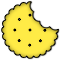

#  The Biscuit Language
[](http://89.177.170.156:8080/job/biscuit/)

## About
The Biscuit is programming language inspired by C, Odin and Jai.
Visit [wiki](https://github.com/travisdoor/bl/wiki) for more informations...

## Example

```rust
#load "libc.bl"

main : fn () s32 {
  printf("fibonacci(2) = %d\n", fib(2));
  printf("fibonacci(5) = %d\n", fib(5));
  printf("fibonacci(10) = %d\n", fib(10));
  return 0;
};

fib : fn (n s32) s32 {
  if n == 0 || n == 1 { return n; }
  else { return fib(n-1) + fib(n-2); }
};
```