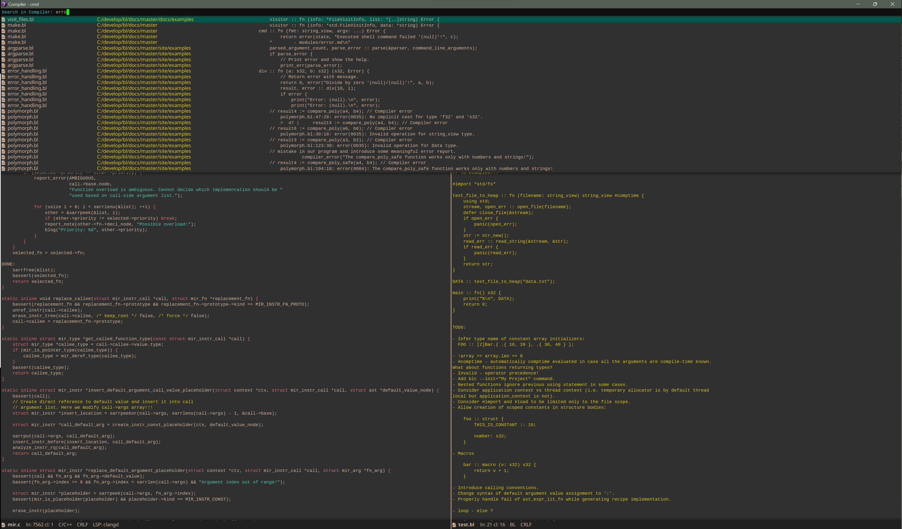
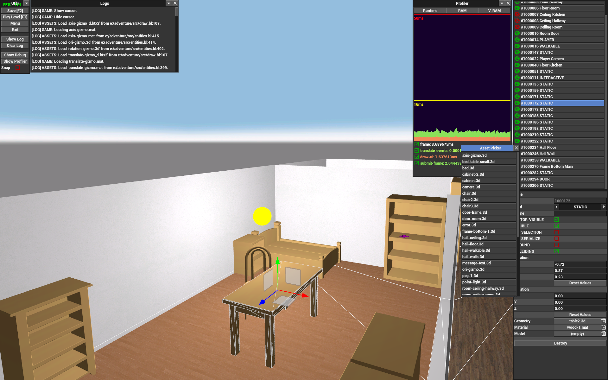

<div style="text-align:center"></div>

# About


[](https://twitter.com/MTravisDoor)

The Biscuit Language (BL) is a simple imperative programming language using LLVM backend and compiler implemented in C.
Language syntax and all its features are still in development. Biscuit is designed to be simple, fast and explicit.

- Project homepage: [biscuitlang.org](https://biscuitlang.org)
- Contact email: [biscuitlang@gmail.com](mailto:biscuitlang@gmail.com)

# Features
* Strongly typed.
* Embedded rich runtime type information.
* Polymorphic functions and structures (generics).
* Simple structure inheritance.
* Compile-time execution (experimental).
* Compile-time function arguments; allow passing types as values (experimental).
* C ABI compatible (C library functions can be directly called).
* Runtime debugging is possible in Visual Studio/gdb/lldb.
* Explicit function overloading.
* Integrated build system.
* Module management.
* Unit testing system.
* Automatic documentation generation.
* Defer statement.
* Multiple return values.
* Custom memory allocators.
* Basic support for game development via `extra` packages.
* Supports Windows, Linux and macOS.
* Nested functions.
* Clean and simple JAI-like syntax.
* And more...

# Installation
See the installation guide [here](https://biscuitlang.org/#installation).

# Example
```rust
HelloWorld :: struct {
    hello: s32;
    world: s32;
};

main :: fn () s32 {
    info :: cast(*TypeInfoStruct) typeinfo(HelloWorld);

    loop i := 0; i < info.members.len; i += 1 {
        print("% ", info.members[i].name);
    }
    print("!!!\n");

    return 0;
}
```

See more examples [here](https://biscuitlang.org/how-to/).

# Authors

- **Martin Dorazil** (travis) [](https://github.com/sponsors/travisdoor)
- **Gmos**

# Discord Server

https://discord.gg/DDTCcYzb9h

# Projects Using BL

### Tine Text Editor

Text editor I use.

- Download [here](https://travisdp.itch.io/tine).
- Source code [here](https://github.com/travisdoor/tine).

<div style="text-align:center"></div>

### Vulkan Renderer & The Game

Screenshot of an unnamed 3D experimental game created using BL.

<div style="text-align:center"></div>


### Space Shooter

- Source code [here](https://github.com/travisdoor/bl/tree/master/how-to/gunner).

<div style="text-align:center"></div>

# Contribution

Please follow the instructions on [wiki](https://github.com/travisdoor/bl/wiki/Contribution).
